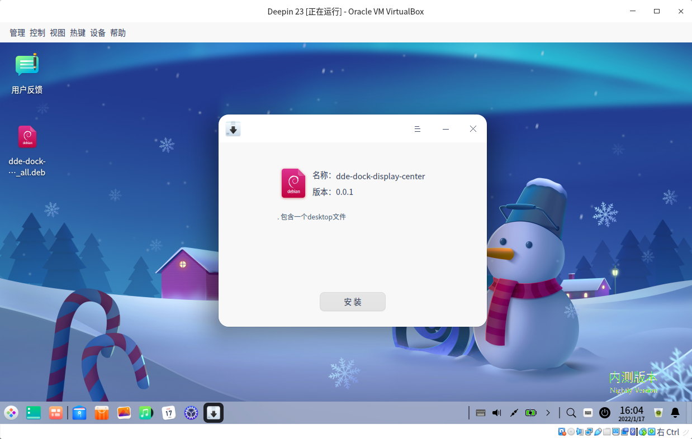
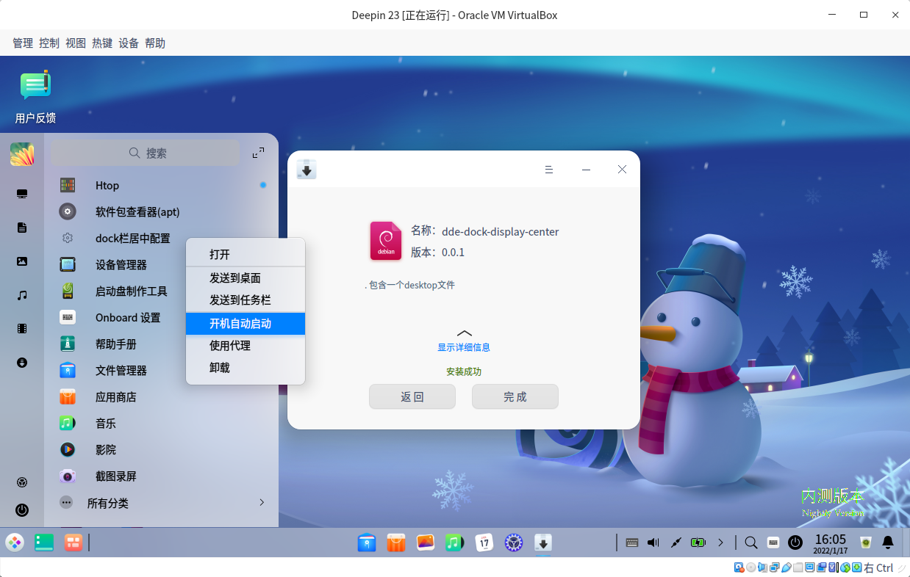

<h1 style="text-align:center;">[Deprecated]</h1>

> deepin 20.5 版本开始已经删除了 classic 字段\
> 无法使用 `gsettings set com.deepin.dde.dock display-mode classic` 设置高效模式居中展示

# dock栏居中配置


```bash
# 内部执行指令:
gsettings set com.deepin.dde.dock display-mode 'classic' 
```

# 截图效果

